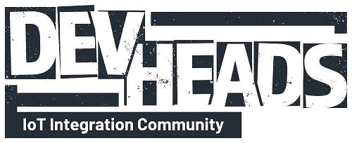

 

The DevHeads IoT Integration Server is a community of professional hardware and software developers who collaborate to solve 
complex system design and engineering challenges. The community accelerates the development, commercialization, and deployment
of electronic systems by sharing real-world knowledge, experience, and validating peers.

## Get Involved in our Community!

There are several places where our community meets. Make sure to check them out!

- 📝 [Website](https://devheads.io/)
- 💬 [Discord](https://discord.gg/devheads)
- ▶️ [YouTube](https://www.youtube.com/@DevHeads)
- 🧑‍💼 [LinkedIn](https://www.linkedin.com/company/devheadscommunity/)
- 🐤 [Twitter](https://twitter.com/DevHeadsComm)

## Projects
### Modbus
- [Modbus Tcp Slave](https://github.com/DevHeadsCommunity/modbusTcpSlave)
- [Modbus Master](https://github.com/DevHeadsCommunity/modbusMaster)
- [Modbus Slave](https://github.com/DevHeadsCommunity/modbusSlave)

### Motor Control
- [BLDC Motor Controller](https://github.com/DevHeadsCommunity/BLDC_MOTOR_CONTROLLER)
- [An FOC implementation](https://github.com/DevHeadsCommunity/Mordor)
- [CAN Motor Driver](https://github.com/DevHeadsCommunity/CANMotorDriver)

### Display
- [Linux HMI](https://github.com/DevHeadsCommunity/motor-control-linux-HMI)
- [LVGL with STM32F4](https://github.com/DevHeadsCommunity/STM32F4_lvgl)

### Artificial Intelligence
- [Screw Type Detection Using ESP-EYE and TensorFlow Lite Micro](https://github.com/DevHeadsCommunity/machine_learning_microcontroller)
- [FreeRTOS Gesture Matching](https://github.com/DevHeadsCommunity/FreeRTOS_Gesture_Matching)
- [Object Detection on ESPCAM](https://github.com/DevHeadsCommunity/Deploy-Edge-Impulse-Object-Detection-Model-on-ESPCAM)
- [Traning Hand Gesture Recognition Using TensorFlow Lite](https://github.com/DevHeadsCommunity/training-gesture-with-tflite)
- [Automated Egg Counting System](https://github.com/DevHeadsCommunity/Automated-Egg-Counting-System)
- [Abandoned Object Detection](https://github.com/DevHeadsCommunity/PICMG-Abandoned-Object)

### FreeRTOS
- [FreeRTOS on the Blackpill](github.com/DevHeadsCommunity/FreeRTOS-BlackPill)
- [FreeRTOS samples](https://github.com/DevHeadsCommunity/FreeRTOS_samples)
- [TensorFlow Lite Micro with FreeRTOS](https://github.com/DevHeadsCommunity/STM32_TFLM_With_FreeRTOS)

### Arduino
- [Classic Bluetooth and BLE](https://github.com/DevHeadsCommunity/How_To_Work_With_Classic_Bluetooth_And_BLE)
- [ESP32 webserver](https://github.com/DevHeadsCommunity/How_To_Build_Webserver_On_ESP32_Dev_Kit)
- [MAX30102](https://github.com/DevHeadsCommunity/MAX30102_by_RF)

### Power systems
- [Open Inverter](https://github.com/DevHeadsCommunity/OpenInverterFirmware)

### Sensors
- [Zynq](https://github.com/DevHeadsCommunity/zynq_sensor_fir_demo)

### Tracing and debugging
- [Real Time Transfer (RTT)](https://github.com/DevHeadsCommunity/RTT)
- [Serial Wire Viewer](https://github.com/DevHeadsCommunity/SWV)
- [Debugging with STM32CubeIDE](https://github.com/DevHeadsCommunity/ep1-debug-stm32)

### FPGAs
- [FPGA Finite State Machine](https://github.com/DevHeadsCommunity/fpga_fsm_demo)

### PCB and Schematics
- [An STM32 Cortex M0 development board](https://github.com/DevHeadsCommunity/DEV_BOARD)

### Build Systems
- [Building CMSIS with Bazel](https://github.com/DevHeadsCommunity/STM32_CMSIS_With_Bazel)

